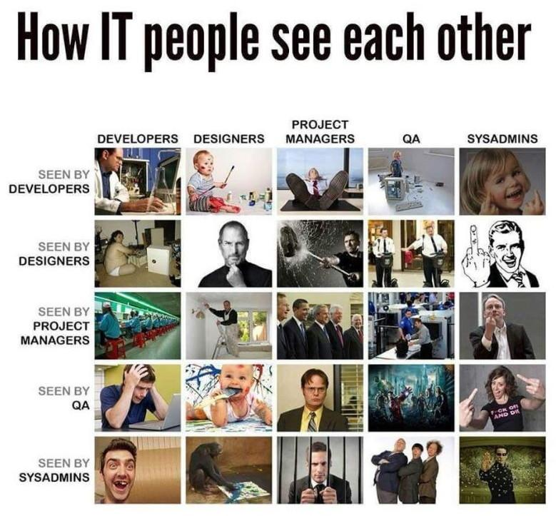

<p align="center">
  
</p>

# holbertonschool-system_engineering-devops

> Servers don't configure themselves — unfortunately.

---

## 📄 Description

This repository gathers my work on the system engineering and DevOps track at Holberton School. It covers the foundations of how web infrastructure is designed, deployed, and maintained at scale. Rather than writing application code, I focused on understanding the systems that make applications run: servers, load balancers, databases, firewalls, monitoring, and everything in between. Each project in this repository pushes me to think like a sysadmin and explain complex infrastructure decisions clearly — out loud, on a whiteboard, without notes.

---

## 🎯 Learning Objectives

Through the projects in this repository, I developed a solid understanding of how web infrastructure is architected from the ground up. I am now able to draw and explain a complete web stack — from DNS resolution to database replication — and justify every component's presence. I understand the concepts of redundancy, scalability, and fault tolerance, and I can identify single points of failure in any architecture. I know how load balancers work, how Primary-Replica database clusters operate, and why HTTPS and firewalls are non-negotiable in production. I am also able to communicate these concepts clearly to a technical audience in a time-constrained setting, which has sharpened both my technical knowledge and my ability to think on my feet.

---

## 📁 Repository Structure

```bash
holbertonschool-system_engineering-devops/
├── web_infrastructure_design/
│   ├── 0-simple_web_stack
│   ├── 1-distributed_web_infrastructure
│   ├── 2-secured_and_monitored_web_infrastructure
│   ├── 3-scale_up
│   └── README.md
└── README.md
```

---

## ✨ Projects / Contents

### web_infrastructure_design
- A series of whiteboarding tasks where I designed web infrastructures of increasing complexity — from a single-server LAMP stack to a scaled, secured, and monitored multi-server architecture. Each task required producing a diagram and being able to explain every component and its trade-offs.
- **Technologies:** Nginx, HAproxy, MySQL (Primary-Replica), SSL/HTTPS, firewalls, Sumologic monitoring, DNS

---

## 🛠️ Technologies Used

This repository focuses on infrastructure concepts rather than application code. The technologies covered include Nginx as a web server, HAproxy for load balancing, MySQL with Primary-Replica replication for the database layer, SSL certificates for encrypted traffic, firewalls for network security, and monitoring tools such as Sumologic. DNS configuration and the LAMP stack are also core topics throughout the projects.

---

## ⚙️ Prerequisites

- OS: Ubuntu 20.04 LTS
- No code execution required for the current projects — tasks are diagram and explanation based
- A whiteboarding tool or paper to design infrastructure diagrams
- An image hosting service (e.g. Imgur) to upload and share diagrams
- Basic understanding of networking concepts (DNS, HTTP/HTTPS, TCP/IP)

---

## ▶️ Usage

```bash
git clone https://github.com/GwenP88/holbertonschool-system_engineering-devops.git
cd holbertonschool-system_engineering-devops
```

Each project lives in its own directory. Navigate into the relevant folder to find task files and the project-level README:

```bash
cd web_infrastructure_design
cat 0-simple_web_stack
```

Task files contain links to hosted diagram screenshots. The project README explains each task's objectives, constraints, and expected outcomes in detail.

---

## 🤝 Contributions & Acknowledgements

Big thanks to the Holberton School team for building a curriculum that makes you explain load balancers out loud until they make sense. Thanks to every documentation page, RFC, and late-night forum thread that filled in the gaps. And to HAproxy — for being more interesting than its name suggests.

---

## 👤 Author

**Gwenaelle PICHOT**
- Student at Holberton School
- Repository: holbertonschool-system_engineering-devops
- GitHub: [@GwenP88](https://github.com/GwenP88)