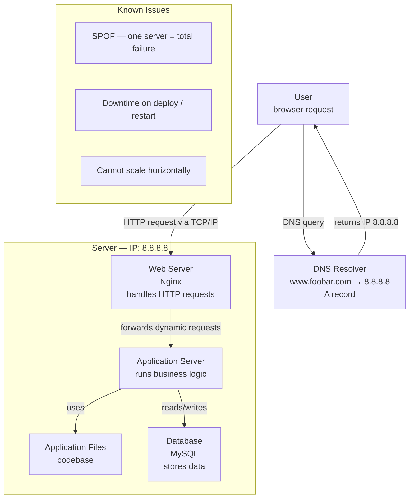

# 0. Simple Web Stack - English version

## Infrastructure Diagram

---

## Specifics

### What is a server?
A server is a physical or virtual machine connected to a network that provides services to other computers (clients). It runs continuously, listening for incoming requests and responding to them. In this infrastructure, the server hosts the entire web stack on a single machine at IP `8.8.8.8`.

### What is the role of the domain name?
The domain name `foobar.com` is a human-readable alias for an IP address. Instead of memorizing `8.8.8.8`, users type `www.foobar.com`. The DNS system translates that name into the IP address so the browser knows where to send the request.

### What type of DNS record is `www` in `www.foobar.com`?
`www` is an **A record**. An A record maps a hostname directly to an IPv4 address. In this case, `www.foobar.com` → `8.8.8.8`.

### What is the role of the web server?
The web server (Nginx) is the entry point for all incoming HTTP/HTTPS requests. It serves static files (HTML, CSS, images) directly and forwards dynamic requests to the application server. It also handles SSL termination, compression, and load routing.

### What is the role of the application server?
The application server executes the business logic of the application. It processes user input, applies rules, queries the database, and builds the dynamic response that gets sent back through Nginx to the user.

### What is the role of the database?
The database (MySQL) stores and manages all persistent data — users, content, settings, transactions. The application server reads from and writes to it via SQL queries.

### What is the server using to communicate with the user's computer?
The server communicates with the user over **HTTP (or HTTPS) on top of TCP/IP** — the standard internet protocol stack. TCP ensures reliable, ordered delivery of packets between the user's browser and the server.

---

## Issues with this infrastructure

### SPOF — Single Point of Failure
There is only one server. If that server crashes, loses power, or becomes unreachable, the entire website goes down. There is no redundancy or failover mechanism.

### Downtime when maintenance is needed
Deploying new code or updating the server often requires restarting Nginx or the application server. During that restart window, the site is unavailable to users. There is no way to do a zero-downtime deployment with a single server.

### Cannot scale if too much incoming traffic
If traffic spikes, there is only one machine to handle all requests. It is not possible to add more capacity horizontally (more servers) without completely redesigning the infrastructure. The single server becomes a bottleneck under load.

---

# 0. Simple Web Stack - version française

## Explications

### Qu'est-ce qu'un serveur ?
Un serveur est une machine physique ou virtuelle connectée à un réseau qui fournit des services à d'autres ordinateurs (les clients). Il fonctionne en continu, à l'écoute des requêtes entrantes auxquelles il répond. Dans cette infrastructure, le serveur héberge toute la pile web sur une seule machine à l'adresse IP `8.8.8.8`.

### Quel est le rôle du nom de domaine ?
Le nom de domaine `foobar.com` est un alias lisible par un humain pour une adresse IP. Au lieu de mémoriser `8.8.8.8`, l'utilisateur tape `www.foobar.com`. Le système DNS traduit ce nom en adresse IP afin que le navigateur sache où envoyer la requête.

### Quel type d'enregistrement DNS est `www` dans `www.foobar.com` ?
`www` est un **enregistrement A**. Un enregistrement A fait correspondre directement un nom d'hôte à une adresse IPv4. Dans ce cas : `www.foobar.com` → `8.8.8.8`.

### Quel est le rôle du serveur web ?
Le serveur web (Nginx) est le point d'entrée de toutes les requêtes HTTP/HTTPS entrantes. Il sert directement les fichiers statiques (HTML, CSS, images) et transfère les requêtes dynamiques au serveur d'application. Il gère également la terminaison SSL, la compression et le routage des requêtes.

### Quel est le rôle du serveur d'application ?
Le serveur d'application exécute la logique métier de l'application. Il traite les entrées utilisateur, applique les règles, interroge la base de données et construit la réponse dynamique qui est renvoyée à l'utilisateur via Nginx.

### Quel est le rôle de la base de données ?
La base de données (MySQL) stocke et gère toutes les données persistantes — utilisateurs, contenus, paramètres, transactions. Le serveur d'application la lit et y écrit via des requêtes SQL.

### Quel protocole le serveur utilise-t-il pour communiquer avec l'ordinateur de l'utilisateur ?
Le serveur communique avec l'utilisateur via **HTTP (ou HTTPS) par-dessus TCP/IP** — la pile de protocoles standard d'internet. TCP garantit une transmission fiable et ordonnée des paquets entre le navigateur de l'utilisateur et le serveur.

---

## Problèmes de cette infrastructure

### SPOF — Point de défaillance unique
Il n'y a qu'un seul serveur. Si ce serveur tombe en panne, perd son alimentation ou devient inaccessible, le site entier est hors ligne. Il n'existe aucun mécanisme de redondance ou de basculement.

### Temps d'arrêt lors des maintenances
Le déploiement de nouveau code ou la mise à jour du serveur nécessite souvent de redémarrer Nginx ou le serveur d'application. Pendant cette fenêtre de redémarrage, le site est indisponible pour les utilisateurs. Il est impossible d'effectuer un déploiement sans interruption de service avec un seul serveur.

### Impossible de scaler en cas de trafic trop important
En cas de pic de trafic, il n'y a qu'une seule machine pour traiter toutes les requêtes. Il est impossible d'ajouter de la capacité horizontalement (plusieurs serveurs) sans repenser entièrement l'infrastructure. Le serveur unique devient un goulot d'étranglement sous charge.