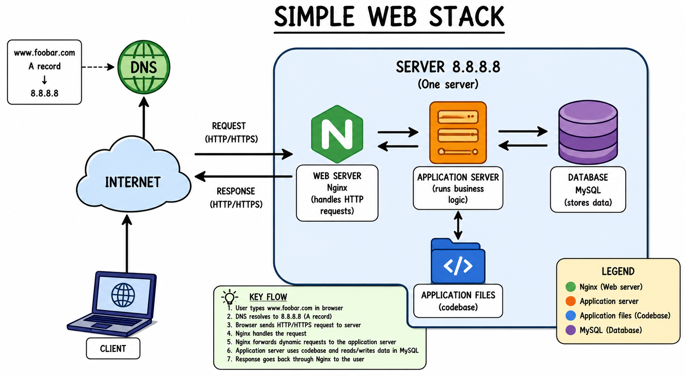

# 0. Simple Web Stack

## Infrastructure Diagram

---

## Specifics

### What is a server?
A server is a computer that provides services to other computers over a network.

### What is the role of the domain name?
A domain name is a human-readable address that points to a server's IP address.

### What type of DNS record is `www` in `www.foobar.com`?
`www.foobar.com` uses an **A record** that points to `8.8.8.8`.

### What is the role of the web server?
The web server (Nginx) receives HTTP requests, serves static files, and forwards dynamic requests to the application server.

### What is the role of the application server?
The application server executes the application's business logic and generates dynamic content.

### What is the role of the database?
The database (MySQL) stores and manages the application's data.

### What is the server using to communicate with the user's computer?
The server communicates with the client using HTTP/HTTPS over TCP/IP.

---

## Issues with this infrastructure

### SPOF (Single Point of Failure)
If the server fails, the entire website becomes unavailable.

### Downtime when maintenance is needed
Restarting services during updates can make the website temporarily unavailable.

### Cannot scale if too much incoming traffic
A single server has limited resources and cannot handle large amounts of traffic.