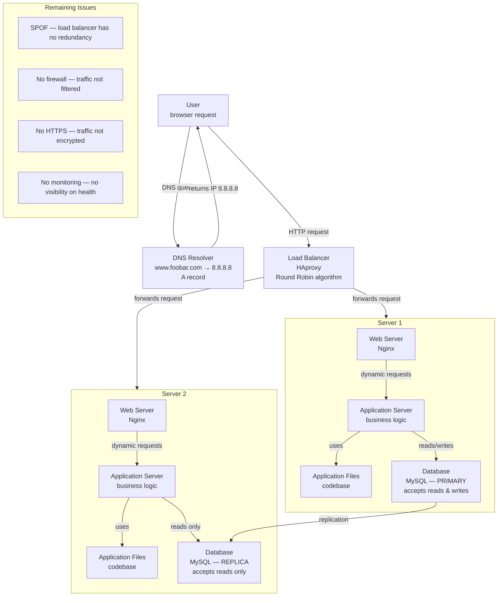

# 1. Distributed Web Infrastructure - English version

## Infrastructure Diagram

---

## Why each element was added

### Load balancer — HAproxy
A single server cannot handle high traffic reliably and creates a SPOF. The load balancer distributes incoming requests across multiple servers, improving availability and performance. If one server goes down, HAproxy continues routing traffic to the remaining one.

### Server 1 and Server 2
Two servers provide redundancy. If one fails, the other continues serving traffic. They also share the load, preventing any single machine from becoming a bottleneck.

### Web server (Nginx) on each server
Nginx handles incoming HTTP requests, serves static files, and forwards dynamic requests to the application server. Each server needs its own Nginx instance to process requests independently.

### Application server on each server
The application server executes the business logic. Each server runs its own instance so requests can be processed in parallel without dependency on a single process.

### Application files (codebase) on each server
Each server needs a local copy of the codebase to execute the application independently without relying on a shared file system.

### Database — Primary/Replica cluster
A single database is a SPOF and a performance bottleneck. The Primary handles all writes and the Replica handles read traffic, distributing the database load and providing a backup in case the Primary fails.

---

## Load balancer distribution algorithm

HAproxy is configured with the **Round Robin** algorithm. It works by distributing incoming requests to each server in turn, cycling through the list sequentially. Request 1 goes to Server 1, request 2 goes to Server 2, request 3 goes back to Server 1, and so on. This ensures an even distribution of load when all servers have similar capacity.

---

## Active-Active vs Active-Passive setup

This load balancer enables an **Active-Active** setup.

**Active-Active** — both servers are running and handling traffic simultaneously. The load balancer distributes requests across all active nodes. If one goes down, the other continues without interruption. This setup maximises resource utilisation and performance.

**Active-Passive** — one server is active and handles all traffic. The second server is on standby and only takes over if the active one fails. Resources on the passive server are idle during normal operation. This setup prioritises failover safety over performance.

---

## How a Primary-Replica (Master-Slave) database cluster works

The **Primary** node is the authoritative source of data. It accepts both read and write operations. Every time data is written to the Primary, the changes are replicated to the Replica node asynchronously (or synchronously depending on configuration).

The **Replica** node receives a continuous stream of changes from the Primary and applies them to its own copy of the data. It accepts read operations only — it cannot process writes directly.

This architecture improves read performance (reads can be distributed) and provides a warm backup: if the Primary fails, the Replica can be promoted to Primary.

---

## Difference between Primary and Replica in regard to the application

The **Primary node** is used for all write operations — INSERT, UPDATE, DELETE. The application sends any data modification to the Primary.

The **Replica node** is used for read operations — SELECT queries. The application can send read traffic to the Replica to reduce load on the Primary.

If the application does not distinguish between read and write connections, all traffic goes to the Primary and the Replica only serves as a backup.

---

## Issues with this infrastructure

### SPOF — Single Point of Failure
The load balancer itself is a SPOF. If HAproxy goes down, no traffic reaches either server and the entire website becomes unavailable. There is no redundant load balancer to take over.

### Security issues
There is no firewall in front of the servers. Any external traffic, including malicious requests, can reach the servers directly without filtering.

There is no HTTPS. All traffic between the user and the infrastructure travels in plain text, exposing sensitive data (passwords, session tokens, personal information) to interception.

### No monitoring
There is no monitoring system in place. If a server goes down, a database replication lag develops, or response times degrade, there is no alert and no visibility. Issues can go undetected until users report them.

---

# 1. Infrastructure Web Distribuée - version française

## Pourquoi chaque élément a été ajouté

### Load balancer — HAproxy
Un seul serveur ne peut pas gérer un trafic élevé de manière fiable et constitue un SPOF. Le load balancer distribue les requêtes entrantes sur plusieurs serveurs, améliorant la disponibilité et les performances. Si un serveur tombe en panne, HAproxy continue de router le trafic vers l'autre.

### Serveur 1 et Serveur 2
Deux serveurs apportent de la redondance. Si l'un tombe en panne, l'autre continue de servir le trafic. Ils se partagent également la charge, évitant qu'une seule machine devienne un goulot d'étranglement.

### Serveur web (Nginx) sur chaque serveur
Nginx gère les requêtes HTTP entrantes, sert les fichiers statiques et transfère les requêtes dynamiques au serveur d'application. Chaque serveur a besoin de sa propre instance Nginx pour traiter les requêtes de manière indépendante.

### Serveur d'application sur chaque serveur
Le serveur d'application exécute la logique métier. Chaque serveur fait tourner sa propre instance pour que les requêtes puissent être traitées en parallèle sans dépendance à un seul processus.

### Fichiers applicatifs (base de code) sur chaque serveur
Chaque serveur a besoin d'une copie locale de la base de code pour exécuter l'application de manière indépendante, sans dépendre d'un système de fichiers partagé.

### Base de données — cluster Primaire/Réplique
Une seule base de données est un SPOF et un goulot d'étranglement. Le nœud Primaire gère toutes les écritures et la Réplique prend en charge le trafic en lecture, distribuant la charge et fournissant une sauvegarde en cas de défaillance du Primaire.

---

## Algorithme de distribution du load balancer

HAproxy est configuré avec l'algorithme **Round Robin**. Il fonctionne en distribuant les requêtes entrantes à chaque serveur à tour de rôle, en parcourant la liste de manière séquentielle. La requête 1 va au Serveur 1, la requête 2 va au Serveur 2, la requête 3 revient au Serveur 1, et ainsi de suite. Cela garantit une distribution équitable de la charge lorsque tous les serveurs ont une capacité similaire.

---

## Configuration Active-Active vs Active-Passive

Ce load balancer active une configuration **Active-Active**.

**Active-Active** — les deux serveurs fonctionnent et traitent le trafic simultanément. Le load balancer distribue les requêtes sur tous les nœuds actifs. Si l'un tombe en panne, l'autre continue sans interruption. Cette configuration maximise l'utilisation des ressources et les performances.

**Active-Passive** — un seul serveur est actif et traite tout le trafic. Le second serveur est en veille et ne prend le relais qu'en cas de défaillance du serveur actif. Les ressources du serveur passif sont inactives en fonctionnement normal. Cette configuration privilégie la sécurité du basculement plutôt que les performances.

---

## Comment fonctionne un cluster de base de données Primaire-Réplique (Master-Slave)

Le nœud **Primaire** est la source de données faisant autorité. Il accepte les opérations de lecture et d'écriture. Chaque fois que des données sont écrites sur le Primaire, les modifications sont répliquées vers le nœud Réplique de manière asynchrone (ou synchrone selon la configuration).

Le nœud **Réplique** reçoit un flux continu de modifications du Primaire et les applique à sa propre copie des données. Il accepte uniquement les opérations de lecture — il ne peut pas traiter les écritures directement.

Cette architecture améliore les performances en lecture (les lectures peuvent être distribuées) et fournit une sauvegarde à chaud : si le Primaire tombe en panne, la Réplique peut être promue en Primaire.

---

## Différence entre le nœud Primaire et le nœud Réplique pour l'application

Le **nœud Primaire** est utilisé pour toutes les opérations d'écriture — INSERT, UPDATE, DELETE. L'application envoie toute modification de données au Primaire.

Le **nœud Réplique** est utilisé pour les opérations de lecture — requêtes SELECT. L'application peut envoyer le trafic de lecture vers la Réplique pour réduire la charge sur le Primaire.

Si l'application ne distingue pas les connexions en lecture et en écriture, tout le trafic va vers le Primaire et la Réplique ne sert que de sauvegarde.

---

## Problèmes de cette infrastructure

### SPOF — Point de défaillance unique
Le load balancer lui-même est un SPOF. Si HAproxy tombe en panne, aucun trafic n'atteint les serveurs et le site devient entièrement indisponible. Il n'existe pas de load balancer redondant pour prendre le relais.

### Problèmes de sécurité
Il n'y a pas de pare-feu devant les serveurs. Tout le trafic externe, y compris les requêtes malveillantes, peut atteindre les serveurs directement sans filtrage.

Il n'y a pas de HTTPS. Tout le trafic entre l'utilisateur et l'infrastructure circule en clair, exposant les données sensibles (mots de passe, tokens de session, informations personnelles) à l'interception.

### Pas de monitoring
Aucun système de monitoring n'est en place. Si un serveur tombe en panne, un retard de réplication de la base de données se développe, ou les temps de réponse se dégradent, il n'y a aucune alerte et aucune visibilité. Les problèmes peuvent passer inaperçus jusqu'à ce que les utilisateurs les signalent.