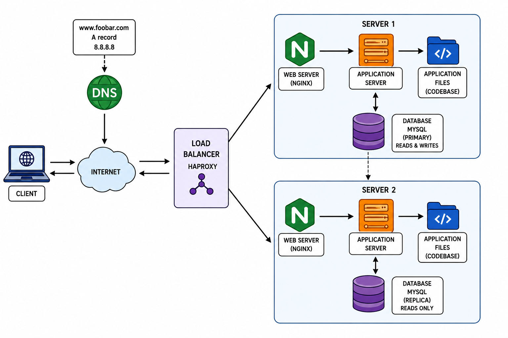

# 1. Distributed Web Infrastructure

## Infrastructure Diagram

---

## Why each element was added

### Load Balancer (HAProxy)
The load balancer distributes incoming requests between the two servers. It improves availability and performance.

### Server 1 and Server 2
Two servers provide redundancy and share the workload. If one server fails, the other can continue serving requests.

### Web Server (Nginx)
Nginx receives HTTP requests, serves static files, and forwards dynamic requests to the application server.

### Application Server
The application server executes the application's business logic.

### Application Files (Codebase)
Each server contains a copy of the application code so it can run independently.

### Primary-Replica Database
The Primary database handles writes, while the Replica database handles reads and serves as a backup.

---

## Load Balancer Distribution Algorithm
HAProxy uses the **Round Robin** algorithm.
Requests are distributed sequentially across the available servers:

- Request 1 → Server 1
- Request 2 → Server 2
- Request 3 → Server 1

This provides an even distribution of traffic.

---

## Active-Active vs Active-Passive
This infrastructure uses an **Active-Active** setup.

### Active-Active
Both servers handle traffic at the same time.

### Active-Passive
One server handles traffic while the second server waits as a backup.

---

## Primary-Replica Database Cluster
The Primary database accepts read and write operations.
Changes made on the Primary are replicated to the Replica database.
The Replica is mainly used for read operations and can be promoted if the Primary fails.

---

## Primary vs Replica

### Primary

- Handles writes
- Handles reads
- Source of truth

### Replica

- Handles reads
- Receives replicated data from the Primary
- Backup database

---

## Issues with this Infrastructure

### SPOF (Single Point of Failure)
The load balancer is still a SPOF. If it fails, the website becomes unavailable.

### Security Issues

- No firewall
- No HTTPS encryption

### No Monitoring
There is no monitoring or alerting system to detect failures or performance issues.