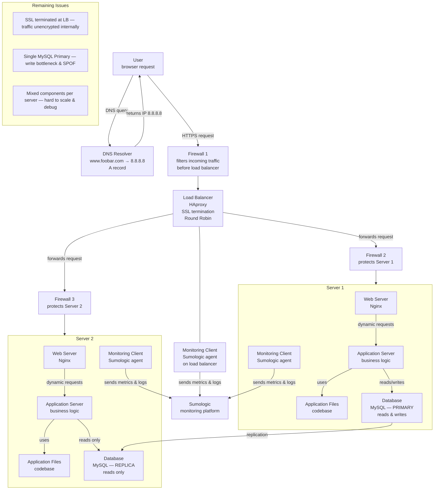

# 2. Secured and Monitored Web Infrastructure

## Infrastructure Diagram

---

## Why each element was added

### 3 Firewalls
Firewalls are added to filter and control network traffic at each critical point of the infrastructure. Firewall 1 sits in front of the load balancer and blocks malicious or unauthorized traffic before it reaches any server. Firewalls 2 and 3 protect each application server individually, ensuring that only traffic coming from the load balancer is allowed through. Without firewalls, the servers are fully exposed to the internet.

### 1 SSL certificate
The SSL certificate is added to serve `www.foobar.com` over HTTPS. It encrypts the communication between the user's browser and the load balancer, protecting sensitive data — passwords, personal information, session tokens — from being intercepted in transit.

### 3 Monitoring clients
Monitoring clients (Sumologic agents) are deployed on each server and on the load balancer to collect metrics, logs, and health data in real time. Without monitoring, there is no visibility into what is happening inside the infrastructure and issues go undetected until users report them.

---

## What are firewalls for?

A firewall is a network security component that monitors and controls incoming and outgoing traffic based on predefined rules. It acts as a barrier between trusted internal components and untrusted external networks. Firewalls block unauthorized access, filter out malicious requests, and restrict communication to only what is explicitly allowed.

---

## Why is traffic served over HTTPS?

HTTPS encrypts the data exchanged between the user and the server using TLS (Transport Layer Security). Without encryption, all traffic travels in plain text and can be intercepted by anyone on the network path — a technique known as a man-in-the-middle attack. HTTPS protects the confidentiality and integrity of user data, and is also required for browser trust indicators (the padlock) and modern web standards.

---

## What is monitoring used for?

Monitoring provides real-time visibility into the health, performance, and availability of the infrastructure. It collects metrics such as CPU usage, memory, response times, error rates, and request counts. It generates alerts when thresholds are exceeded or components fail, allowing engineers to react before users are impacted. It also provides historical data for debugging and capacity planning.

---

## How does the monitoring tool collect data?

Each monitoring client (Sumologic agent) is installed directly on the server it monitors. It continuously collects logs (application logs, system logs, access logs) and metrics (CPU, RAM, disk I/O, network), then ships them to the Sumologic platform over a secure connection. Sumologic aggregates, indexes, and visualises this data in dashboards and triggers alerts based on configured rules.

---

## How to monitor web server QPS (Queries Per Second)

To monitor QPS on Nginx, configure the monitoring client to read and parse the Nginx access log (`/var/log/nginx/access.log`). Each line in this log represents one request. The Sumologic agent tails this file in real time, counts the number of requests per second, and sends that metric to the monitoring platform. A dashboard can then display QPS over time and trigger an alert if it exceeds or drops below a defined threshold.

Alternatively, enable the Nginx stub status module (`ngx_http_stub_status_module`) which exposes a real-time endpoint with request counts that the agent can scrape directly.

---

## Issues with this infrastructure

### Terminating SSL at the load balancer level is an issue
When SSL is terminated at the load balancer, the traffic between the load balancer and the backend servers travels in plain text over the internal network. If the internal network is compromised, that traffic can be intercepted. A fully secure setup requires end-to-end encryption — SSL should be maintained all the way to the application servers.

### Having only one MySQL server capable of accepting writes is an issue
The Primary node is the only database server that accepts write operations. If the Primary fails, writes become impossible and the application breaks. It is also a performance bottleneck: all write traffic is funnelled through a single machine, which limits throughput as the application scales.

### Having servers with all the same components might be a problem
When every server runs a web server, application server, and database simultaneously, the components compete for the same CPU, memory, and disk resources. A spike in database activity can degrade web server performance on the same machine. It also makes scaling harder — if you only need more database capacity, you cannot scale it independently without also adding unnecessary web server and application server instances. Debugging becomes more complex too, as issues can originate from any layer on any server.

--- 

# 2. Infrastructure Web Sécurisée et Monitorée

## Pourquoi chaque élément a été ajouté

### 3 Pare-feux
Les pare-feux sont ajoutés pour filtrer et contrôler le trafic réseau à chaque point critique de l'infrastructure. Le pare-feu 1 se situe devant le load balancer et bloque le trafic malveillant ou non autorisé avant qu'il n'atteigne un serveur. Les pare-feux 2 et 3 protègent chaque serveur d'application individuellement, en s'assurant que seul le trafic provenant du load balancer est autorisé. Sans pare-feux, les serveurs sont entièrement exposés à internet.

### 1 Certificat SSL
Le certificat SSL est ajouté pour servir `www.foobar.com` via HTTPS. Il chiffre la communication entre le navigateur de l'utilisateur et le load balancer, protégeant les données sensibles — mots de passe, informations personnelles, tokens de session — contre toute interception en transit.

### 3 Clients de monitoring
Les clients de monitoring (agents Sumologic) sont déployés sur chaque serveur et sur le load balancer pour collecter des métriques, des logs et des données de santé en temps réel. Sans monitoring, il n'y a aucune visibilité sur ce qui se passe dans l'infrastructure et les problèmes passent inaperçus jusqu'à ce que les utilisateurs les signalent.

---

## À quoi servent les pare-feux ?

Un pare-feu est un composant de sécurité réseau qui surveille et contrôle le trafic entrant et sortant selon des règles prédéfinies. Il agit comme une barrière entre les composants internes de confiance et les réseaux externes non fiables. Les pare-feux bloquent les accès non autorisés, filtrent les requêtes malveillantes et limitent la communication à ce qui est explicitement autorisé.

---

## Pourquoi le trafic est-il servi via HTTPS ?

HTTPS chiffre les données échangées entre l'utilisateur et le serveur grâce au protocole TLS (Transport Layer Security). Sans chiffrement, tout le trafic circule en clair et peut être intercepté par n'importe qui sur le chemin réseau — une technique connue sous le nom d'attaque de l'homme du milieu (man-in-the-middle). HTTPS protège la confidentialité et l'intégrité des données utilisateur, et est également requis pour les indicateurs de confiance des navigateurs (le cadenas) et les standards web modernes.

---

## À quoi sert le monitoring ?

Le monitoring fournit une visibilité en temps réel sur la santé, les performances et la disponibilité de l'infrastructure. Il collecte des métriques telles que l'utilisation du CPU, la mémoire, les temps de réponse, les taux d'erreur et le nombre de requêtes. Il génère des alertes lorsque des seuils sont dépassés ou que des composants tombent en panne, permettant aux ingénieurs de réagir avant que les utilisateurs ne soient impactés. Il fournit également des données historiques pour le débogage et la planification de la capacité.

---

## Comment l'outil de monitoring collecte-t-il les données ?

Chaque client de monitoring (agent Sumologic) est installé directement sur le serveur qu'il surveille. Il collecte en continu les logs (logs applicatifs, logs système, logs d'accès) et les métriques (CPU, RAM, I/O disque, réseau), puis les envoie à la plateforme Sumologic via une connexion sécurisée. Sumologic agrège, indexe et visualise ces données dans des tableaux de bord et déclenche des alertes selon des règles configurées.

---

## Comment monitorer les QPS du serveur web ?

Pour monitorer les QPS (Queries Per Second) sur Nginx, on configure le client de monitoring pour qu'il lise et analyse le log d'accès Nginx (`/var/log/nginx/access.log`). Chaque ligne de ce fichier représente une requête. L'agent Sumologic suit ce fichier en temps réel, compte le nombre de requêtes par seconde et envoie cette métrique à la plateforme de monitoring. Un tableau de bord peut ensuite afficher les QPS dans le temps et déclencher une alerte si la valeur dépasse ou descend en dessous d'un seuil défini.

Il est également possible d'activer le module Nginx stub status (`ngx_http_stub_status_module`) qui expose un endpoint en temps réel avec le comptage des requêtes, que l'agent peut scraper directement.

---

## Problèmes de cette infrastructure

### Terminer le SSL au niveau du load balancer est un problème
Lorsque le SSL est terminé au niveau du load balancer, le trafic entre le load balancer et les serveurs backend circule en clair sur le réseau interne. Si le réseau interne est compromis, ce trafic peut être intercepté. Une configuration pleinement sécurisée nécessite un chiffrement de bout en bout — le SSL doit être maintenu jusqu'aux serveurs d'application.

### N'avoir qu'un seul serveur MySQL capable d'accepter les écritures est un problème
Le nœud Primaire est le seul serveur de base de données qui accepte les opérations d'écriture. Si le Primaire tombe en panne, les écritures deviennent impossibles et l'application se bloque. C'est également un goulot d'étranglement en termes de performances : tout le trafic d'écriture est canalisé à travers une seule machine, ce qui limite le débit à mesure que l'application évolue.

### Avoir des serveurs avec tous les mêmes composants peut être un problème
Lorsque chaque serveur fait tourner simultanément un serveur web, un serveur d'application et une base de données, les composants se disputent les mêmes ressources CPU, mémoire et disque. Un pic d'activité de la base de données peut dégrader les performances du serveur web sur la même machine. Cela rend également le scaling plus difficile — si on n'a besoin que de plus de capacité pour la base de données, il est impossible de la faire évoluer indépendamment sans ajouter inutilement des instances de serveur web et de serveur d'application. Le débogage devient aussi plus complexe, car les problèmes peuvent provenir de n'importe quelle couche sur n'importe quel serveur.