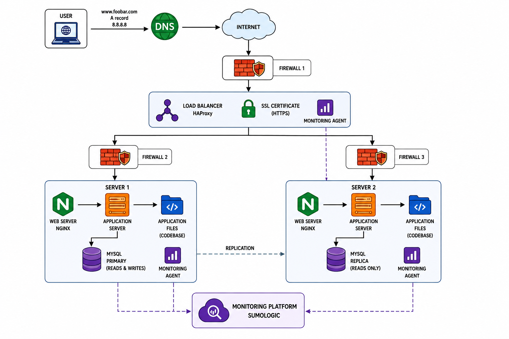

# 2. Secured and Monitored Web Infrastructure

## Infrastructure Diagram

---

## Why each element was added

### Firewalls
Firewalls filter incoming and outgoing traffic and protect the infrastructure from unauthorized access.

### SSL Certificate
The SSL certificate enables HTTPS and encrypts communication between users and the website.

### Monitoring Clients
Monitoring clients collect logs and metrics from the servers and send them to a monitoring platform.

---

## What are firewalls for?
Firewalls control network traffic and block unauthorized connections.

---

## Why is traffic served over HTTPS?
HTTPS encrypts data exchanged between the client and the server, protecting sensitive information.

---

## What is monitoring used for?
Monitoring helps track the health, performance, and availability of the infrastructure.

---

## How does the monitoring tool collect data?
Monitoring agents installed on each server collect logs and metrics and send them to the monitoring service.

---

## How to monitor web server QPS?
Configure the monitoring tool to collect request statistics from Nginx logs or status endpoints and calculate Queries Per Second (QPS).

---

## Issues with this infrastructure

### SSL termination at the load balancer
Traffic between the load balancer and backend servers is not encrypted.

### Only one MySQL server accepts writes
The Primary database is a bottleneck and a single point of failure for write operations.

### Servers contain all components
Running the web server, application server, and database on the same machine makes scaling and resource management more difficult.