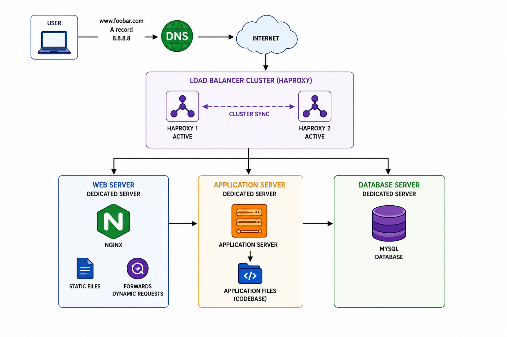

# 3. Scale Up

## Infrastructure Diagram

---

## Why each element was added

### Additional Server
An additional server was added to separate the infrastructure components and improve scalability.

### Additional Load Balancer
A second HAProxy load balancer was added to remove the load balancer as a Single Point of Failure (SPOF).

### HAProxy Cluster
The two load balancers are configured as a cluster. If one fails, the other continues handling traffic.

### Dedicated Web Server
The web server (Nginx) is isolated on its own server. It serves static content and forwards dynamic requests.

### Dedicated Application Server
The application server is isolated on its own server. It executes the application's business logic.

### Dedicated Database Server
The database is isolated on its own server. It stores and manages application data without competing for resources with other services.

---

## Benefits of this Architecture

### Better Scalability
Each component can be scaled independently.

### Better Performance
Web, application, and database services no longer compete for CPU, memory, and disk resources.

### Better Reliability
The load balancer cluster removes a major Single Point of Failure.

### Easier Maintenance
Each layer can be managed and upgraded independently.

### Easier Troubleshooting
Problems can be isolated more easily because each service runs on a dedicated server.