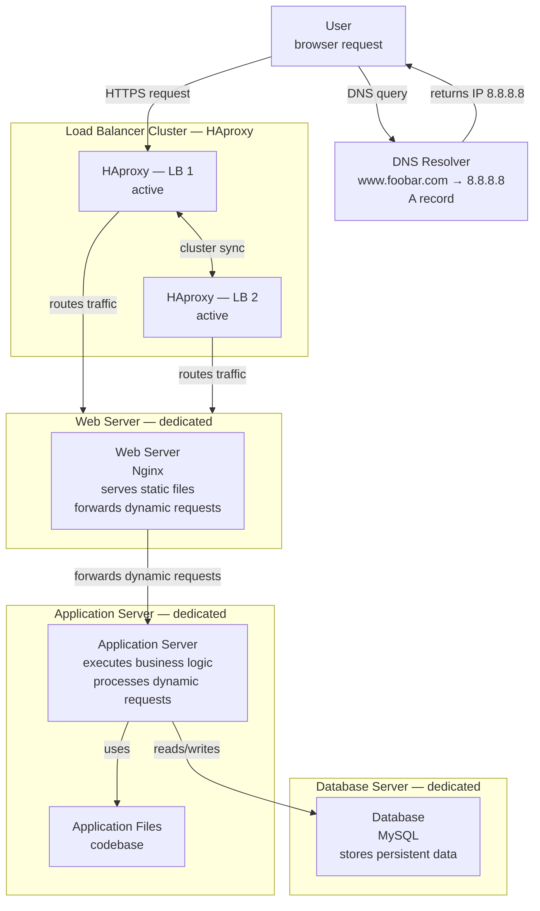

# 3. Scale Up

## Infrastructure Diagram

---

## Why each element was added

### 1 additional server (total: 4 servers)
In the previous infrastructure, each server ran a web server, an application server, and a database simultaneously. All components competed for the same CPU, memory, and disk resources on a single machine. Adding a dedicated server for each component means that the web server, the application server, and the database each run in isolation on their own machine. This eliminates resource contention, makes each layer independently scalable, and simplifies debugging by isolating where issues originate.

### 1 additional load balancer (HAproxy cluster)
The previous infrastructure had a single load balancer, which was a Single Point of Failure (SPOF). If that HAproxy instance went down, no traffic could reach the servers and the entire website would become unavailable. Adding a second HAproxy instance and configuring both as a cluster eliminates this SPOF. The two load balancers synchronise their state and work together — if one fails, the other takes over seamlessly without any interruption to the service.

### Dedicated web server
The web server (Nginx) now runs on its own machine. Its sole responsibility is to handle incoming HTTP/HTTPS requests, serve static content (HTML, CSS, images, JavaScript), and forward dynamic requests to the application server. Isolating Nginx means its resources are not shared with the application or the database, and it can be scaled independently if static traffic increases.

### Dedicated application server
The application server now runs on its own machine. It handles only the execution of business logic — processing user input, applying rules, and building dynamic responses. It no longer competes with the web server or the database for resources. If the application needs more processing power, this server can be upgraded or replicated without touching the web or database layer.

### Dedicated database server
The database (MySQL) now runs on its own machine with dedicated CPU, memory, and disk I/O. Database operations are resource-intensive, especially under heavy read/write load. Isolating it prevents database activity from degrading the performance of the web server or the application server. It also makes storage scaling straightforward — disk capacity can be expanded on this server independently.

---

# 3. Scale Up

## Pourquoi chaque élément a été ajouté

### 1 serveur supplémentaire (total : 4 serveurs)
Dans l'infrastructure précédente, chaque serveur faisait tourner simultanément un serveur web, un serveur d'application et une base de données. Tous les composants se disputaient les mêmes ressources CPU, mémoire et disque sur une seule machine. L'ajout d'un serveur dédié pour chaque composant signifie que le serveur web, le serveur d'application et la base de données fonctionnent chacun de manière isolée sur leur propre machine. Cela élimine la contention de ressources, permet de faire évoluer chaque couche indépendamment et simplifie le débogage en isolant l'origine des problèmes.

### 1 load balancer supplémentaire (cluster HAproxy)
L'infrastructure précédente n'avait qu'un seul load balancer, qui constituait un Point de Défaillance Unique (SPOF). Si cette instance HAproxy tombait en panne, aucun trafic ne pouvait atteindre les serveurs et le site devenait entièrement indisponible. L'ajout d'une seconde instance HAproxy configurée en cluster avec la première élimine ce SPOF. Les deux load balancers synchronisent leur état et travaillent ensemble — si l'un tombe en panne, l'autre prend le relais sans aucune interruption de service.

### Serveur web dédié
Le serveur web (Nginx) tourne désormais sur sa propre machine. Sa seule responsabilité est de traiter les requêtes HTTP/HTTPS entrantes, de servir le contenu statique (HTML, CSS, images, JavaScript) et de transférer les requêtes dynamiques au serveur d'application. Isoler Nginx signifie que ses ressources ne sont pas partagées avec l'application ou la base de données, et qu'il peut être mis à l'échelle indépendamment si le trafic statique augmente.

### Serveur d'application dédié
Le serveur d'application tourne désormais sur sa propre machine. Il gère uniquement l'exécution de la logique métier — traitement des entrées utilisateur, application des règles et construction des réponses dynamiques. Il ne concurrence plus le serveur web ou la base de données pour les ressources. Si l'application a besoin de plus de puissance de traitement, ce serveur peut être mis à niveau ou répliqué sans toucher à la couche web ou base de données.

### Serveur de base de données dédié
La base de données (MySQL) tourne désormais sur sa propre machine avec un CPU, une mémoire et des I/O disque dédiés. Les opérations de base de données sont gourmandes en ressources, surtout sous forte charge de lecture/écriture. L'isoler empêche l'activité de la base de données de dégrader les performances du serveur web ou du serveur d'application. Cela simplifie également le scaling du stockage — la capacité disque peut être augmentée sur ce serveur de manière indépendante.